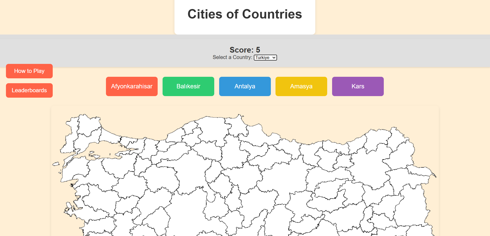
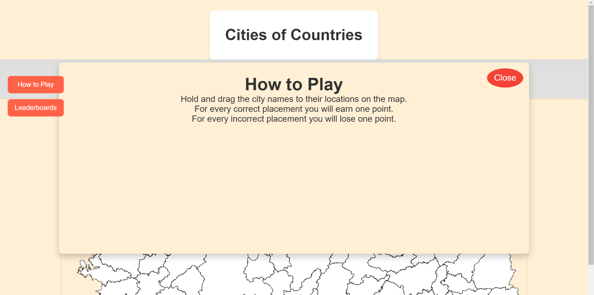

# GMT458 INTERNET BASED GEOGRAPHICAL INFORMATION SYSTEMS

* 2200674002 İrem ADAY

### Github-Pages of the Game

https://github.com/GMT-458-Web-GIS/geogame-Irem-aday

# GeoGame - Cities of Countries

Cities of Countries is an interactive quizz game where the player tests their knowledge of city locations of some coutries.

## How to Play

- **Start of Game** The game starts when the player chooses a country. The player is given 5 points and 5 random cities in the start.

- **Point System**  After every correct guess a ne city is assigned in its place at random. Every correct answer adds a point and every incorrect answer substracts one.

- **End of Game**: Game ends when the player drops down to 0 points or places all the cities correctly.
	- if the player drops down to 0 points game message says "Game over: You have found X cities correctly."
	- if the player places all the cities correctly game message says "Congratulations! You have completed the map!"

## Requirements

### User Requirements

- Players should see city borders clearly.
- Players should be able to hold and drag the city names.
- Players receive feedback on whether their placements are correct or incorrect.
- An ending message are displayed at the end of the game.

### Technical Requirements

- **Leaflet.js**: Used for map functionalities, such as displaying the mute map and the placed cities.
- **D3.js**: Used for obtaining city names and the recognition for correct places for city names.
- Compatibility with modern web browsers.

### Hardware Requirements

- A web browser (e.g., Chrome, Firefox, Safari, Edge).
- Internet connection (to load map data).

## Technologies Used

The project utilizes the following libraries and technologies:

- **HTML**: Provides the structure of the web page.
- **CSS**: Defines the visual styling and layout of the game interface.
- **JavaScript**: Manages game logic and user interactions.
- **Leaflet.js**: Provides interactive map functionality, enabling map navigation and marker placement.
- **D3.js**: Adds animations and graphical feedback when a correct answer is selected.

## Design and UI

- **Map Area**: The main map area, powered by Leaflet.js, displays mute map.
- **City list area**: Positioned above the map and has the 5 cities player can choose to place on the Leaflet map.
- **Scoreboard** Displays how many points player has.

## Project File Structure
GeoGame/  
- ├── index.html # Main HTML file with the game layout and structure
- ├── styles.css # CSS file for styling the game interface     
- ├── script.js # JavaScript file for game logic and map interactions   
- ├── images/ # Folder for images (city photos and marker icons) 
- ├── README.md # Project documentation and description 

  
### 1. Layout of the Webpage

- General layout of the webpage.
  

### 2. How to Play section

- How to Play section for players
  

